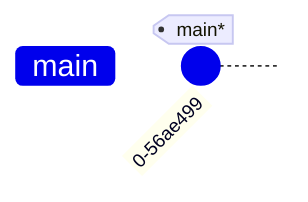
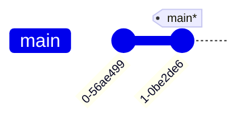

---
tags:
  - extra/git
cssclasses:
  - mermaid-center
git-section: Committing changes
git-section-order: "2"
git-order: "3"
image: git-commit-image.png
---

[[Git Commands.base|↖ Ritorna all'indice ↖]]

---
A **commit** in Git is an operation that saves changes to the version control repository, capturing a snapshot of the project's current state along with a message describing the changes made. 

Each commit is identified by a unique ID and allows users to track the history of their project over time.

## Make a commit

```bash
git commit -m "[descriptive message]"
```

> Save your [[Stage|staged]] changes to the local repository.

> [!TIP]
> To get a nice-looking tree view of commits with their IDs, you can use:
>
> ```bash
> git log --oneline --graph --decorate --all
> ```

^45ae6b

##### Example



```bash
$ git commit -m "A new commit"
```



## Related (advanced)

> [!NOTE]- Changing the Last Commit
> ![[Commit amend]]
