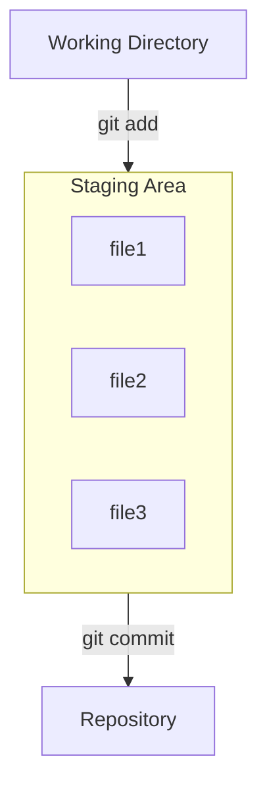

---
tags:
  - extra/git
cssclasses:
  - mermaid-center
git-section: Committing changes
git-section-order: "2"
git-order: "2"
image: git-stage-image.png
---

[[Git Commands.base|↖ Ritorna all'indice ↖]]

---
The "**Staging Area**" or "index" is an intermediate area where files can be reviewed before [[Commit|committing]] them.



There are two types of files:

-   *Staged*: files that are in the staging area.
-   *Unstaged*: files that are not staged.

## Adding to the stage area

```bash
git add [file]
```

> Add a file as it looks now to your next commit (stage).

##### Example

```shell
$ git status
On branch main
Untracked files:
 (use "git add <file>..." to include in what will be committed)
       myfile

no changes added to commit (use "git add" and/or "git commit -a")
```

```bash
$ git add myfile
```

##### Example

```shell
$ git status
On branch main
Changes to be committed:
 (use "git rm --cached <file>..." to unstage)
       new file:   myfile
```

### Add all edited files

```bash
git add --all
```

> Add all edited files to your next commit.

## Restore changes

### Staged files

```bash
git restore --staged [file]
```

> Unstage a file while retaining the changes in the working directory.

### Unstaged files

```bash
git restore [file]
```

> Erase every change made to a file in the working directory.

---
- [Fonte](https://git-scm.com/about/staging-area)