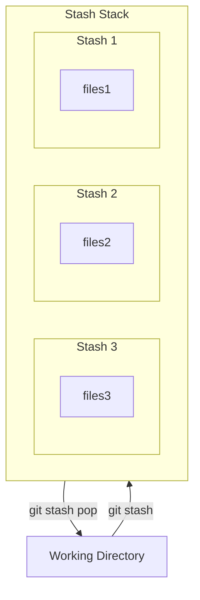

---
tags:
    - extra/git
cssclasses:
    - mermaid-center
git-section: Committing changes
git-section-order: "2"
git-order: "4"
image: git-stash-image.png
---

[[Git Commands.base|↖ Ritorna all'indice ↖]]

---

The **Stash** is a temporary shelve of changes you've made to your working directory so you can work on something else, and then come back and re-apply them later on.



Stashing is handy if you need to quickly switch context and work on something else, but you're mid-way through a code change and aren't quite ready to commit.

## List the stashes

```bash
git stash list
```

> List the stashes that you currently have. Each stash has an ID and a message.

## Stash changes

```bash
git stash -m "[A stash message]"
```

> Take your uncommitted changes (both staged and unstaged), saves them away for later use.

##### Example

```bash
$ git status
On branch main
Changes not staged for commit:
 (use "git add <file>..." to update what will be committed)
 (use "git restore <file>..." to discard changes in working directory)
       modified:   myfile
       modified:   otherfile
```

```bash
$ git stash
```

```bash
$ git status
On branch main
nothing to commit, working tree clean
```

## Apply a stash

```bash
git stash pop [stash@\{stash_number\}]
```

> Remove and apply a single stashed state from the stash list. You can specify which stash to apply by defining its ID, otherwise, the latest stash will be used.

## Delete a stash

```bash
git stash drop [stash@\{stash_number\}]
```

> Remove a single stashed state from the stash list **_permanently_**. You can specify which stash to delete by defining its ID, otherwise, the latest stash will be used.

---
- [Fonte](https://www.atlassian.com/git/tutorials/saving-changes/git-stash)