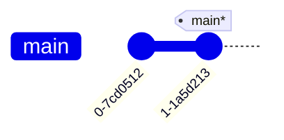
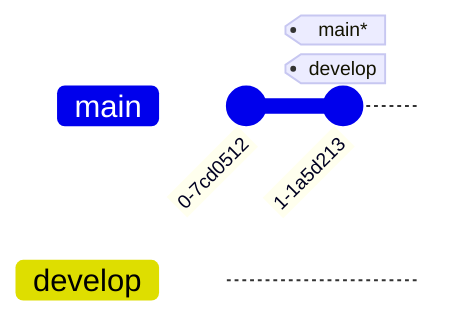
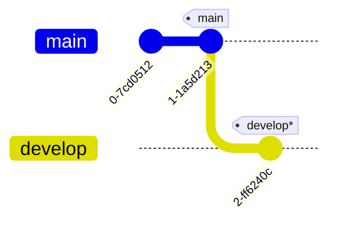
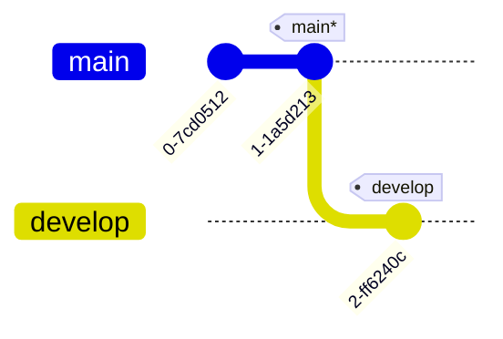
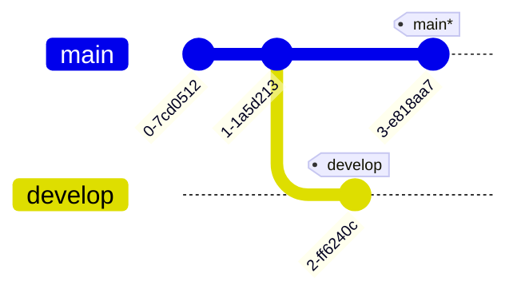

---
tags:
    - extra/git
cssclasses:
    - mermaid-center
git-section: Branching and Refs
git-section-order: "3"
git-order: "1"
image: git-branch-image.png
---

[[Git Commands.base|↖ Ritorna all'indice ↖]]

---
A **branch** in Git is a separate workspace that allows you to make changes and develop new features without affecting the main stable project. The first branch is named `main` (or `master` in older versions).

It helps manage different tasks independently and can be merged back into the main branch once the work is complete.

Technically, branches are just pointers to a specific [[Commit]]. ^8312dc

## Create a new branch

```bash
git branch [name]
```

> Create a new branch from the current HEAD.

##### Example



```bash
$ git branch develop
```



> [!NOTE] New branch
> It is created on the latest commit of the current checked out branch ([[HEAD]]).

## Switch active branch

```bash
git checkout [branch] [-b]
```

> Switch the current branch to the one selected.

The flag `-b` creates a new branch if it does not exist and checks it out.
##### Example

> [!NOTE]
> The current branch is represented with `*`.


```bash
# Move HEAD to the develop branch
$ git checkout develop
```


```bash
# Commit on the develop branch
$ git commit -m "A new commit"
```



```bash
# Move HEAD to the main branch
$ git checkout main
```



```bash
# Commit on the main branch
$ git commit -m "A new commit"
```



## Move branch refs around (advanced)

> [!INFO]- Reassign a branch to a commit (with branch -f)
> ![[Relative Refs#Reassign a branch to a commit]]

> [!INFO]- Move an ancestor branch into the current branch (with merge)
> ![[Merge#Move an ancestor branch into the current branch]]

> [!INFO]- Move an ancestor branch into the current branch (with rebase)
> ![[Rebase#Move an ancestor branch into the current branch]]

---
- [Fonte](https://www.atlassian.com/git/tutorials/using-branches)