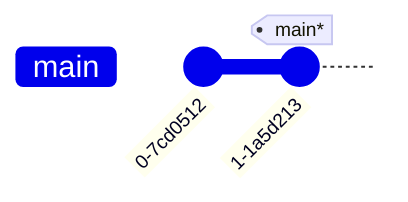
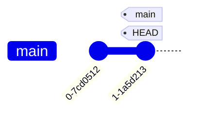
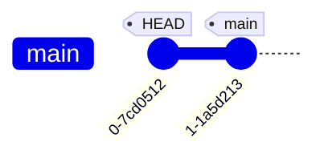

---
tags:
  - extra/git
cssclasses:
  - mermaid-center
git-section: Branching and Refs
git-section-order: "3"
git-order: "2"
image: git-head-image.png
aliases: Detaching HEAD
---

[[Git Commands.base|↖ Ritorna all'indice ↖]]

---
**HEAD** in Git is the symbolic name for the **currently checked out [[Commit]] (or [[Branch#^8312dc|Branch]])**. It's essentially what commit you're working on top of.

HEAD always points to the most recent commit, which is reflected in the working tree.

Most git commands which make changes to the working tree (like `git commit`) will start by changing HEAD.

## Traverse commits (detaching HEAD)

Detaching HEAD just means **attaching it to a commit** instead of a branch. It uses the same `git checkout` command (used for [[Branch#Switch active branch|switching the active branch]]), but passing the commit ID to it.

```bash
git checkout [commit-id]
```

![[Commit#^45ae6b]]

##### Example

> [!NOTE]
> "->" means "points to".

HEAD -> branch `main` -> commit `1-1a5d213`



```bash
$ git checkout 1-1a5d213
```

HEAD -> commit `1-1a5d213`



```bash
$ git checkout 0-7cd0512
```

HEAD -> commit `0-7cd0512`


