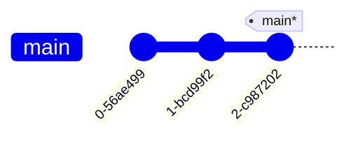
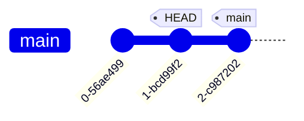
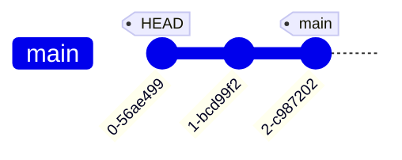
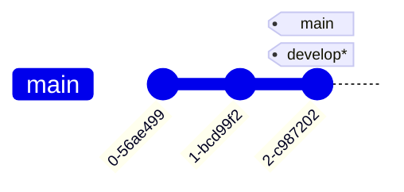

---
tags:
    - extra/git
cssclasses:
    - mermaid-center
git-section: Branching and Refs
git-section-order: "3"
git-order: "3"
image: git-refs-image.png
---

[[Git Commands.base|↖ Ritorna all'indice ↖]]

---

Specifying [[Commit|commits]] by their ID isn't the most convenient thing, which is why Git has **relative refs**.

With relative refs, you can start somewhere memorable (like the branch `develop` or `HEAD`) and work from there.

## Move to a previous commit

### Move upwards one commit at the time

You use the `^`.

##### Example



```bash
$ git checkout HEAD^ # or main^ in this particular case
```



### Move upwards a number of times

You use `~<num>` (tilde and a number).

##### Example


```bash
$ git checkout HEAD~2 # or main~2 in this particular case
```



> [!TIP]
> Count the edges of the graph to understand where HEAD should go to.

## Reassign a branch to a commit

```bash
git branch -f [branch] [commit-id-or-branch-or-ref]
```

> Move (by force) the selected [[Branch]] to the specified commit (or branch).

> [!NOTE]
> You cannot execute this command when the target is your currently checked out branch.

##### Example



```bash
$ git branch -f main HEAD~2
```


