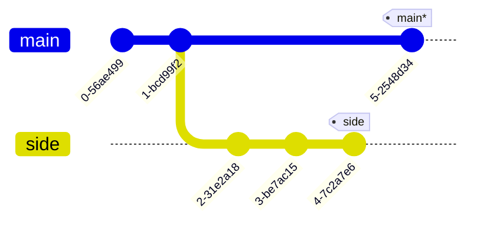
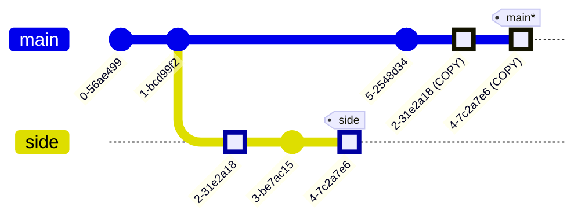

---
tags:
    - extra/git
cssclasses:
    - mermaid-center
git-section: Combining work
git-section-order: "4"
git-order: "3"
image: git-cherry-pick-image.png
---

[[Git Commands.base|↖ Ritorna all'indice ↖]]

---

Similar to [[Rebase#Interactive rebase|interactive rebase]], but you can choose manually from the CLI which commits to copy (as long as those commits aren't ancestors of [[HEAD]]).

---

```bash
git cherry-pick [commit1] [commit2] [...]
```

> Copy a series of commits below your current location.

##### Example



```bash
# Be sure to be on the main branch
$ git cherry-pick 2-31e2a18 4-7c2a7e6
```



---

> [!TIP]+
>
> -   To track down a bug put in a few debug commands and a few print statements in their own commits (**`C1`**) in the branch `bugFix`.
> -   Find and fix the bug in a new commit (**`C2`**).
> -   Get `bugFix` back into `main` without debug statements with
>
> ```bash
> $ git checkout main
> $ git cherry-pick C2
> ```
