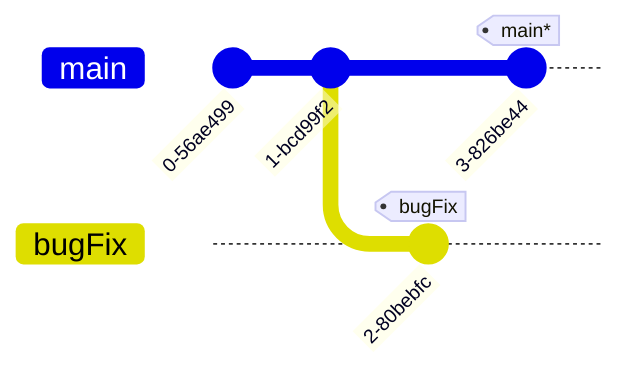
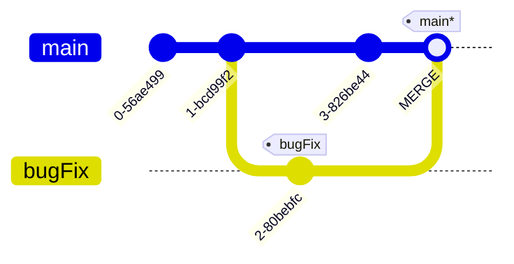
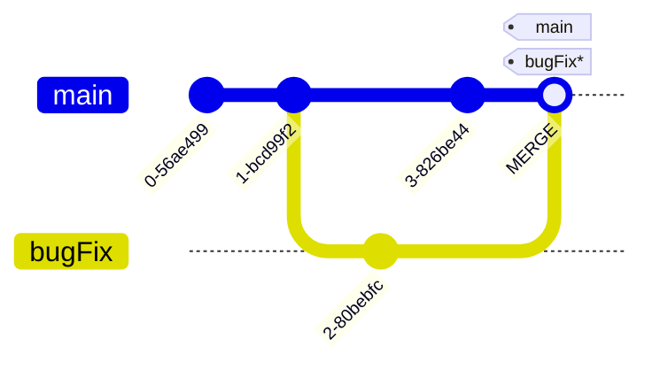

---
tags:
    - extra/git
cssclasses:
    - mermaid-center
git-section: Combining work
git-section-order: "4"
git-order: "1"
image: git-merge-image.png
---

[[Git Commands.base|↖ Ritorna all'indice ↖]]

---

One of the two ways to combining work between branches.

**Merging** in Git creates a special [[Commit]] that will combine multiple sequences of commits into one unified history.

---

```bash
git merge [branch-to-merge-into-current-branch]
```

> Merge the specified branch into HEAD.

##### Example



```bash
# Be sure to be on the main branch
$ git merge bugFix
```



### Move an ancestor branch into the current branch

> [!TIP]- This is an alternative to using branch -f
> ![[Relative Refs#Reassign a branch to a commit]]


```bash
$ git checkout bugFix # The branch to update
$ git merge main # Where to put the branch
```



Since `bugFix` was an ancestor of `main`, Git didn't have to do any work; it simply just moved `bugFix` to the same commit `main` was attached to.
