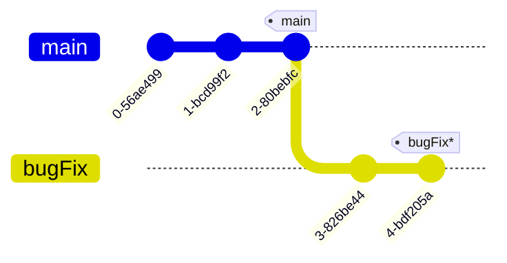
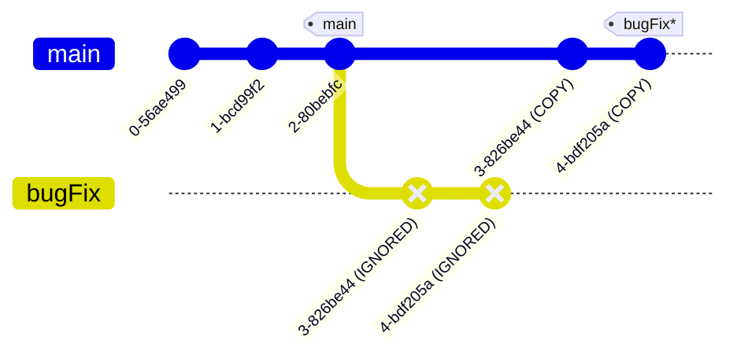
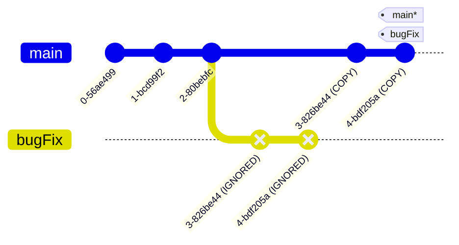
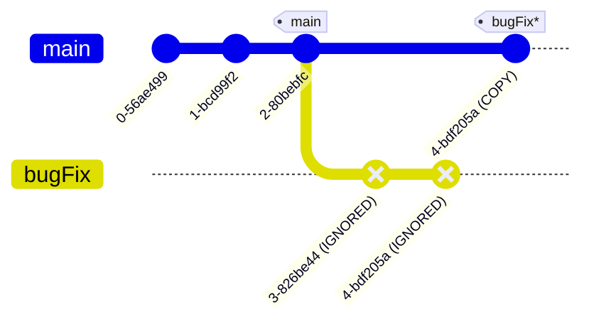

---
tags:
    - extra/git
cssclasses:
    - mermaid-center
git-section: Combining work
git-section-order: "4"
git-order: "2"
image: git-rebase-image.png
---

[[Git Commands.base|↖ Ritorna all'indice ↖]]

---

One of the two ways to combining work between branches.

**Rebasing** in Git essentially takes a set of commits, "copies" them, and attaches them somewhere else.

The advantage of rebasing is that it can be used to make a nice linear sequence of commits. The commit log / history of the repository will be a lot cleaner if only rebasing is allowed.

---

```bash
git rebase [branch-where-to-rebase-into]
```

> Copy all commits from HEAD and put them after the tip of the specified branch.

##### Example



```bash
# Be sure to be on the bugFix branch
$ git rebase main
```



> [!NOTE]
> The old commits will be ignored and the HEAD ref (or the current branch) will be moved alongside the copied commits.

### Move an ancestor branch into the current branch

> [!TIP]- This is an alternative to using branch -f
> ![[Relative Refs#Reassign a branch to a commit]]


```bash
$ git checkout main # Where to put the branch
$ git rebase bugFix # The branch to use as update
```

Or in one line:

```bash
$ git rebase bugFix main
```

Read it as: "Rebase the changes of `bugFix` in `main`"



Since `main` was an ancestor of `bugFix`, Git simply moved the `main` branch reference forward in history.

## Interactive rebase

```bash
git rebase -i [branch-where-to-rebase-into]
```

> Review a series of commits (in a text editor) you're about to rebase.

You can:

-   Change the order of commits
    -   The commits at the top of the files are the oldest ones, while the ones at the bottom are the recent ones
-   Drop a commit
    -   Delete the line of the commit

##### Example


```bash
# Be sure to be on the bugFix branch
$ git rebase -i main
```

```
TEXT OPENED:
4-bdf205a
```


