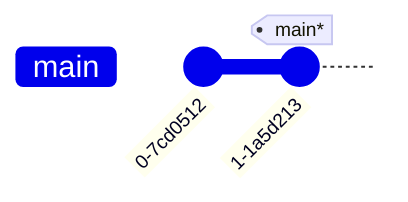
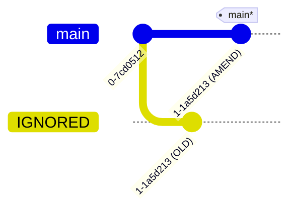

---
tags:
    - extra/git
cssclasses:
    - mermaid-center
git-section: Reversing changes
git-section-order: "5"
git-order: "3"
image: git-amend-image.png
---

[[Git Commands.base|↖ Ritorna all'indice ↖]]

---

The `git commit --amend` command is a convenient way to modify the most recent commit.

It lets you combine staged changes with the previous commit instead of creating an entirely new commit. It can also be used to simply edit the previous commit message without changing its snapshot.

But, amending does not just alter the most recent commit, it replaces it entirely, meaning the amended commit will be a new entity. To Git, it will look like a brand new commit.

> [!WARNING] Don't amend public commits
> Amended commits are actually entirely new commits and the previous commit will no longer be on your current branch. This has the same consequences as resetting a public snapshot. Avoid amending a commit that other developers have based their work on. This is a confusing situation for developers to be in and it's complicated to recover from.

---

```bash
git commit --amend [--no-edit | -m]
```

The `--no-edit` flag will allow you to make the amendment to your commit without changing its commit message. While, the `-m` flag renames the commit.

##### Example



```bash
# Add some files to the stage before
$ git commit --amend --no-edit
```



---
- [Fonte](https://www.atlassian.com/git/tutorials/rewriting-history)