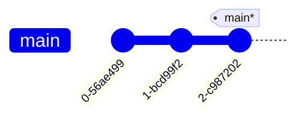
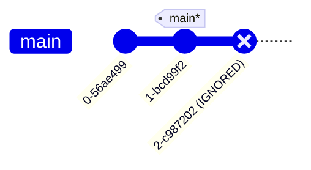
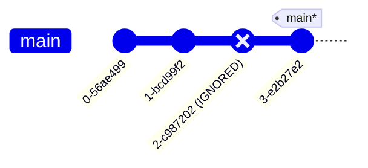
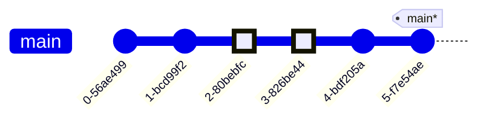
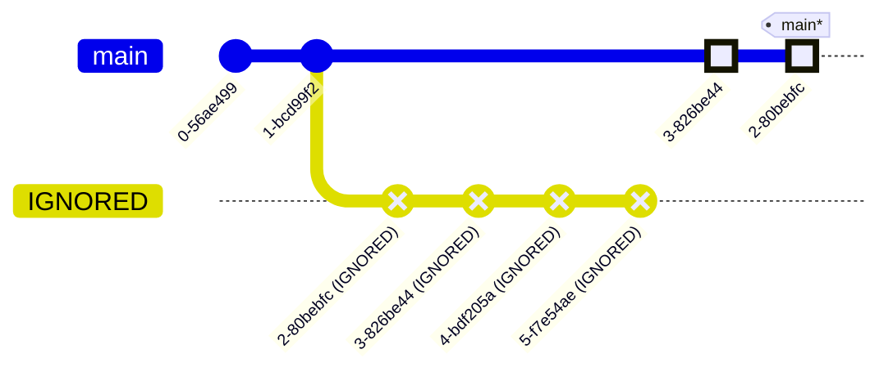

---
tags:
    - extra/git
cssclasses:
    - mermaid-center
git-section: Reversing changes
git-section-order: "5"
git-order: "1"
image: git-reset-image.png
---

[[Git Commands.base|↖ Ritorna all'indice ↖]]

---

One of the two primary ways to undo changes in Git.

> [!warning]
> This method does not work for [[Remote Branches]], only for local branches on your machine.

## Reset

```bash
git reset [commit-id-or-ref]
```

> This reverses changes by moving a branch [[Relative Refs#Reassign a branch to a commit|moving a branch reference backwards in time to an older commit]], as if the newer commit had never been made in the first place.

##### Example



```bash
$ git reset HEAD^
```



> [!NOTE]+
> Each time you reset a branch to a commit, the changes made by the commits after this one will be ignored.

```bash
$ git commit -m "A new commit"
```



### Soft reset

```bash
git reset --soft [commit-id-or-ref]
```

> This command is used to undo the last commit **while keeping the changes in the [[Stage|staging area]]**, allowing you to modify or recommit them later.

> [!TIP]+
> If you reset only one commit, this is useful for when you have forgotten to add something to it (instead of using [[Commit amend]]).

## Keep some changes

Use [[Rebase#Interactive rebase|Interactive rebase]] with the HEAD ref to select what commits to keep



```bash
$ git rebase -i HEAD~4
```

```
TEXT OPENED:
3-826be44 # Put this first
2-80bebfc
```


