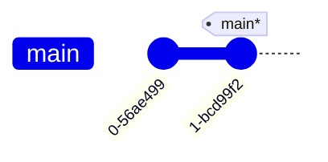
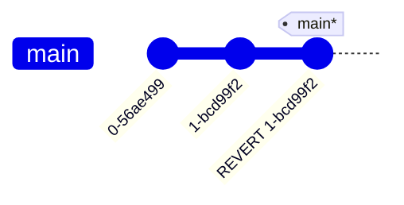

---
tags:
    - extra/git
cssclasses:
    - mermaid-center
git-section: Reversing changes
git-section-order: "5"
git-order: "2"
image: git-revert-image.png
---

[[Git Commands.base|↖ Ritorna all'indice ↖]]

---

One of the two primary ways to undo changes in Git.

This is used for reversing changes and [[Push|push them to remote]].

---

```bash
git revert [branch-or-commit-id-or-HEAD]
```

> Creates a new commit that holds changes to undo **_ONLY_** the selected commit.

##### Example



```bash
$ git revert main
```


