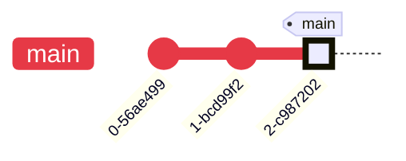
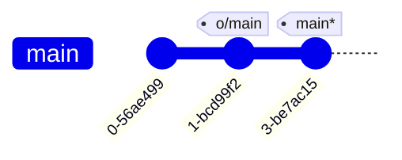
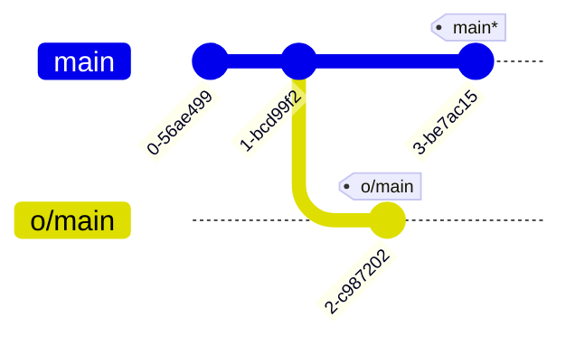
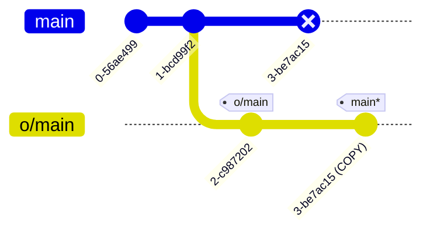
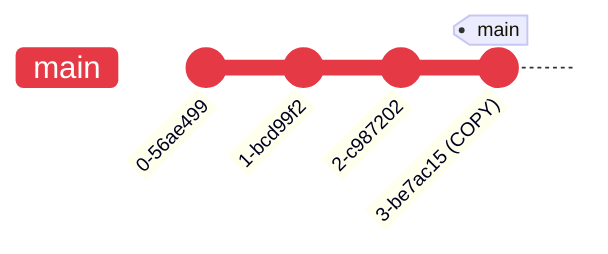
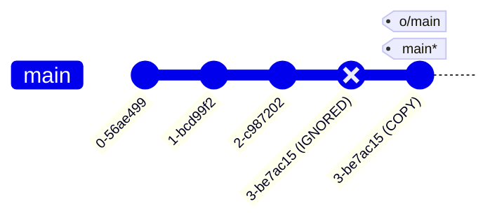
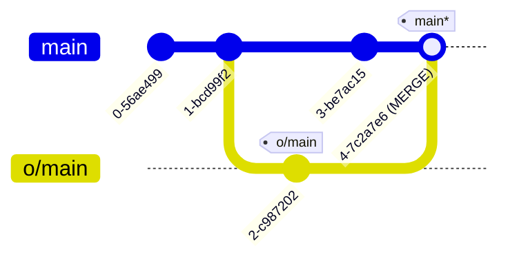
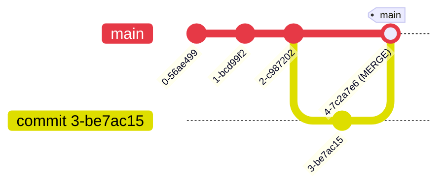
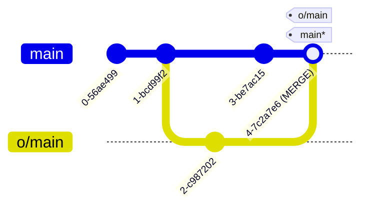

---
tags:
    - extra/git
cssclasses:
    - mermaid-center
git-section: Remote collaboration
git-section-order: "6"
git-order: "6"
image: git-diverged-work-image.png
---

[[Git Commands.base|↖ Ritorna all'indice ↖]]

---
When working with Git, it's common for multiple people to make changes to the same repository. If you start developing on one version of the project **while others continue committing to the remote**, your local work can fall behind and become outdated. In this situation, running a [[Push]] becomes ambiguous.

To prevent this kind of conflict, Git blocks the push when histories have diverged. Before sharing your work, you must first update your local repository to **include the latest state of the remote**. This ensures that everyone's changes are integrated in a consistent way.

## With rebase

The most straightforward is to move your work via [[Rebase|rebasing]] to rewrite the history of local.

##### Example

<center style="margin-bottom: 2em"><b>PUBLISHED</b></center>



<center style="margin-top: 2em; margin-bottom: 2em"><b>LOCAL</b></center>



> [!NOTE]
> Local does not have the commit `2-c987202`.

```bash
# Download the changes from remote
$ git fetch
```

<center style="margin-top: 2em; margin-bottom: 2em"><b>LOCAL</b></center>



```bash
# Copy the work on main and put it after o/main
$ git rebase o/main
```

<center style="margin-top: 2em; margin-bottom: 2em"><b>LOCAL</b></center>



> [!SUMMARY] Do this with only one command
> Download changes from remote and execute a rebase.
> 
> ```bash
> git pull --rebase
> ```

```bash
# Publish the work
$ git push
```

<center style="margin-bottom: 2em"><b>PUBLISHED</b></center>



<center style="margin-top: 2em; margin-bottom: 2em"><b>LOCAL</b></center>



## With merge

Although [[Merge]] doesn't move your work (and instead just creates a merge commit), it's a way to tell Git that you have incorporated all the changes from the remote. This is because the remote branch is now an _ancestor_ of your own branch, meaning your commit reflects all commits in the remote branch.

##### Example

<center style="margin-bottom: 2em"><b>PUBLISHED</b></center>


<center style="margin-top: 2em; margin-bottom: 2em"><b>LOCAL</b></center>


> [!NOTE]
> Local does not have the commit `2-c987202`.

```bash
# Download the changes from remote
$ git fetch
```

<center style="margin-top: 2em; margin-bottom: 2em"><b>LOCAL</b></center>


```bash
# Create a merge commit between main and o/main
$ git merge o/main
```

<center style="margin-top: 2em; margin-bottom: 2em"><b>LOCAL</b></center>



> [!SUMMARY] Do this with only one command
> Download changes from remote and execute a merge.
> 
> ```bash
> git pull # The default way to solve diverged work is with merge.
> ```

```bash
# Publish the work
$ git push
```

<center style="margin-bottom: 2em"><b>PUBLISHED</b></center>



<center style="margin-top: 2em; margin-bottom: 2em"><b>LOCAL</b></center>

