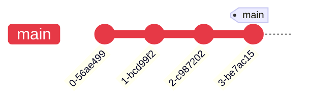
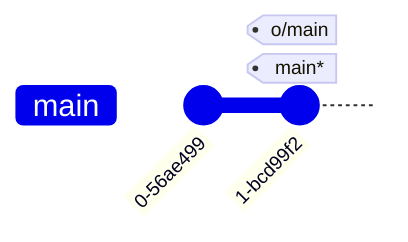
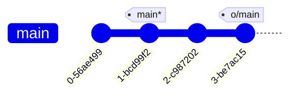

---
tags:
    - extra/git
cssclasses:
    - mermaid-center
git-section: Remote collaboration
git-section-order: "6"
git-order: "3"
image: git-fetch-image.png
---

[[Git Commands.base|↖ Ritorna all'indice ↖]]

---
The command `git fetch` essentially brings our _local_ representation of the remote repository into synchronization with what the _actual_ remote repository looks like.

It performs two main steps:

-   downloads the commits that the remote has but are missing from our local repository ^36b077
-   updates the location of [[Remote Branches|remote branches point]] (for example, `o/main`) ^c16473

---

```bash
git fetch
```

> Download objects and refs from the remote.

##### Example

<center><b>PUBLISHED</b></center>



<center style="margin-top: 2em"><b>LOCAL</b></center>



```bash
$ git fetch
```

<center style="margin-bottom: 2em"><b>PUBLISHED</b></center>


<center style="margin-top: 2em; margin-bottom: 2em"><b>LOCAL</b></center>



> [!NOTE]
> It does not update your local branches refs, only the remote ones.
> See [[Branch#Move branch refs around (advanced)]].
