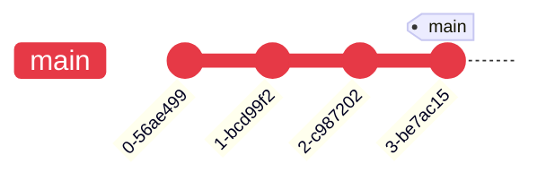
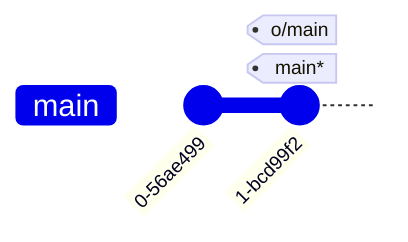
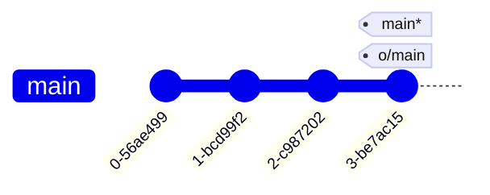

---
tags:
    - extra/git
cssclasses:
    - mermaid-center
git-section: Remote collaboration
git-section-order: "6"
git-order: "4"
image: git-pull-image.png
---


[[Git Commands.base|↖ Ritorna all'indice ↖]]

---

Automates the [[Fetch|fetching]] of changes from remote and updating the local branch refs.

It does three things:
![[Fetch#^36b077]]
![[Fetch#^c16473]]

-   merges the downloaded commits with the local repository

---

```bash
git pull
```

> Fetch from remote and merge with local.

##### Example

<center><b>PUBLISHED</b></center>



<center style="margin-top: 2em"><b>LOCAL</b></center>



```bash
$ git pull
```

<center style="margin-bottom: 2em"><b>PUBLISHED</b></center>


<center style="margin-top: 2em; margin-bottom: 2em"><b>LOCAL</b></center>


