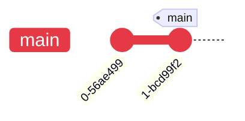
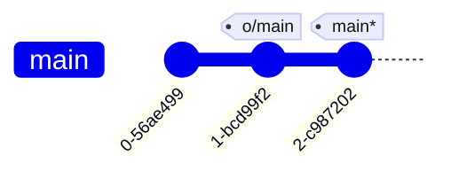
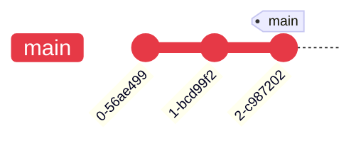
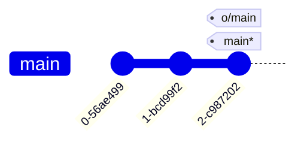

---
tags:
    - extra/git
cssclasses:
    - mermaid-center
git-section: Remote collaboration
git-section-order: "6"
git-order: "5"
image: git-push-image.png
---

[[Git Commands.base|↖ Ritorna all'indice ↖]]

---
This command is responsible for uploading _your_ changes to a specified remote and updating that remote to incorporate your new commits.

---

```bash
git push
```

> Update remote refs along with associated objects.


> [!TIP] Pushing a branch that doesn't exist in remote
> ```bash
> git push --set-upstream origin [local-only-branch]
> ```

^ce54f8


##### Example

<center style="margin-bottom: 2em"><b>PUBLISHED</b></center>



<center style="margin-top: 2em; margin-bottom: 2em"><b>LOCAL</b></center>



```bash
$ git push
```

<center style="margin-bottom: 2em"><b>PUBLISHED</b></center>



<center style="margin-top: 2em; margin-bottom: 2em"><b>LOCAL</b></center>


