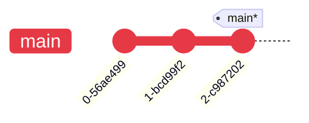
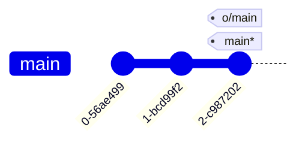

---
tags:
    - extra/git
cssclasses:
    - mermaid-center
git-section: Remote collaboration
git-section-order: "6"
git-order: "2"
image: git-remote-image.png
---

[[Git Commands.base|↖ Ritorna all'indice ↖]]

---

**Remote branches** reflect the **state of remote repositories**. They help you understand _the difference between your local work and what work is public_.

They have the special property that when you check them out, you are put into [[HEAD#Traverse commits (detaching HEAD)|detached HEAD mode]]. Git does this on purpose because **you can't work on these branches directly**; you have to work elsewhere and then share your work with the remote (after which your remote branches will be updated).

> [!NOTE]
> Remote branches are on your _local_ repository, not on the remote repository.

They are displayed in the format of:

```
origin/<branch name>
o/<branch name>
```

##### Example

<center><b>PUBLISHED</b></center>



<center style="margin-top: 2em"><b>LOCAL</b></center>


