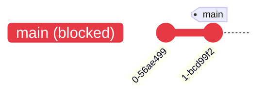
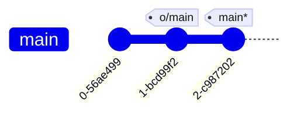
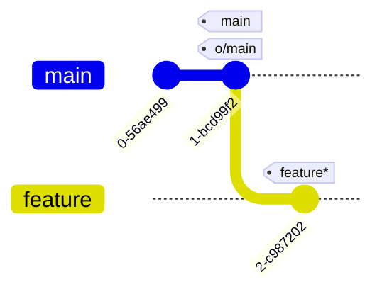
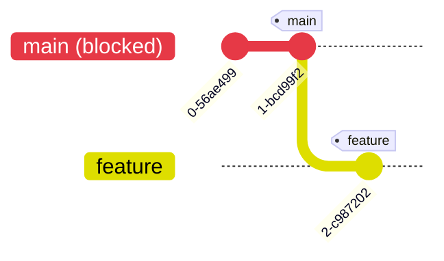
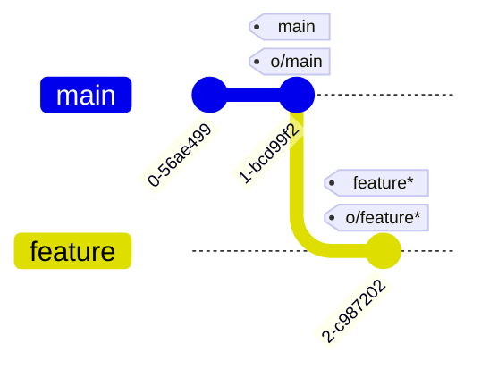

---
tags:
  - extra/git
cssclasses:
  - mermaid-center
git-section: Remote collaboration
git-section-order: "6"
git-order: "8"
image: git-remote-rejected-image.png
---

[[Git Commands.base|↖ Ritorna all'indice ↖]]

---
If you work on a large collaborative team it's likely that **main is locked** and requires some Pull Request process to merge changes. 

If you commit directly to main locally and try pushing you will be greeted with a message similar to this:

```error
! [remote rejected] main -> main (TF402455: Pushes to 
this branch are not permitted; you must use a pull request to update 
this branch.)
```

## Solution
- Create another branch called `feature` on the same commit of `main`
- Push `feature` to the remote with [[Push#^ce54f8|push origin]]
- Reset your main back to be in sync with the remote with [[Relative Refs#Reassign a branch to a commit|branch -f]], otherwise you may have issues next time you do a pull and someone else's commit conflicts with yours

##### Example

<center style="margin-bottom: 2em"><b>PUBLISHED</b></center>



<center style="margin-top: 2em; margin-bottom: 2em"><b>LOCAL</b></center>



```bash
# Move the main ref to o/main
$ git branch -f main o/main
# Create a new branch on the commit to push
$ git checkout -b feature 2-c987202
```

<center style="margin-top: 2em; margin-bottom: 2em"><b>LOCAL</b></center>




```bash
$ git push
```

<center style="margin-bottom: 2em"><b>PUBLISHED</b></center>



<center style="margin-top: 2em; margin-bottom: 2em"><b>LOCAL</b></center>

